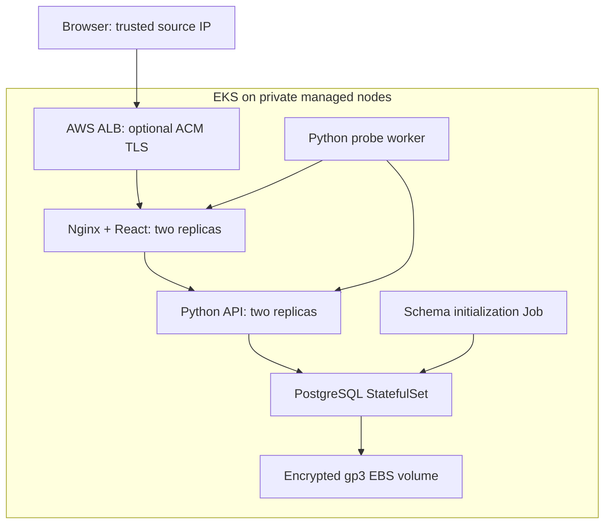

# Architecture and design choices

ALB targets the frontend service's Pod IPs. Nginx proxies `/api/` to the internal
API service using Kubernetes DNS; the browser uses one origin, so no CORS
configuration is needed. API/DB services are not external load balancers.

The worker probes `/readyz` on the API and `/healthz` on Nginx. It measures elapsed
request time with a monotonic clock and submits a validated observation with a
shared bearer token. A timeout or connection error is recorded with a null HTTP
status. Probe data is persisted centrally, so a frontend/API Pod restart does not
lose history. Requests and probes log JSON to stdout. The dashboard refreshes every
five seconds and marks data older than 30 seconds as stale; stored data expires
after seven days as new observations arrive.

The API's `/healthz` checks that it can serve requests. `/readyz` checks database
connectivity and the observations table. A database outage removes API Pods from
Service endpoints without restarting healthy processes. The initialization Job
runs idempotent SQL with bounded retries. It is an ordinary Helm resource, rather
than a pre-install hook that would deadlock waiting for a not-yet-created database.
This initializer is sufficient for the supplied schema; future schema changes
need versioned migrations and backward-compatible rollout design.

The frontend has a multi-stage Node build and Nginx runtime image. The API builds
Python wheels in one stage and installs only runtime artifacts in the final
image. The worker has no Python package dependencies. App containers are non-root,
use read-only root filesystems in Compose/Helm, and have writable `/tmp` where
needed. PostgreSQL uses its image's alpine postgres UID 70 and requires writable
data/runtime paths. It is not configured with a read-only root filesystem.

API database connections are opened per request with connection/statement timeouts.
This keeps the code small for learning; higher traffic would justify a connection
pool and a framework/server stack suited to the team's requirements. Gunicorn is
used for container HTTP serving; the standard-library dev server is offline only.

Two stateless replicas, rolling updates, PodDisruptionBudgets, and optional HPA
provide Kubernetes behavior to demonstrate. They do not make the whole system
highly available: the single database, single NAT gateway, single worker, and lack
of managed failover remain explicit tradeoffs. PostgreSQL volume retention is not
a backup. Prefer RDS Multi-AZ, tested backups, managed secrets, TLS/auth for readers,
full monitoring, and stronger network restrictions for a production design.
